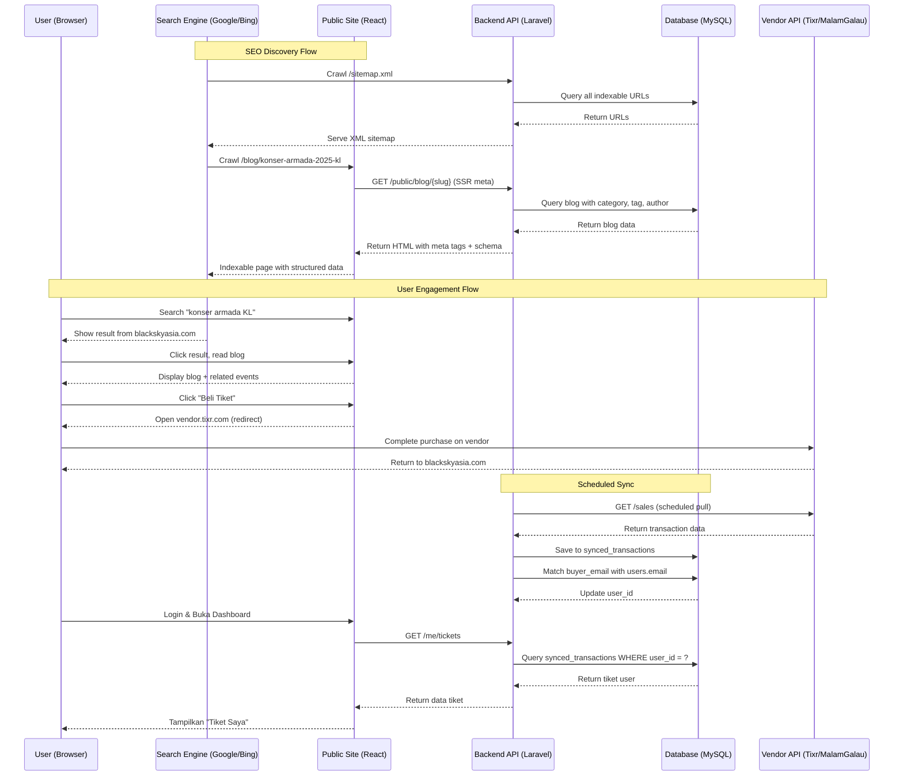
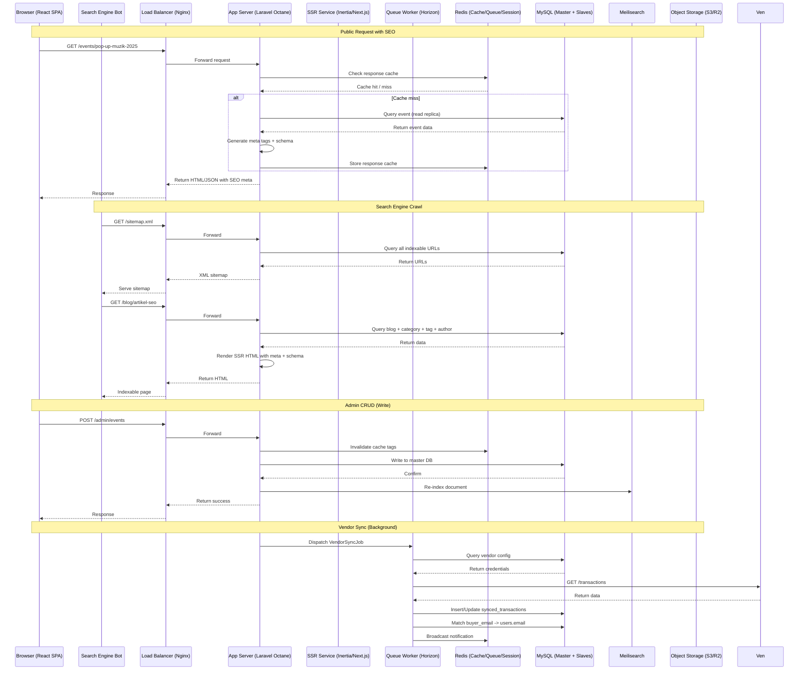

# PRD — Project Requirements Document
# Black Sky Asia Enterprise — Event Promoter Platform
## Versi 5.0 — Blog CMS + SEO Page One

**Version:** 5.0  
**Date:** 2026-05-13  
**Prepared For:** Black Sky Asia Enterprise  
**Prepared By:** Development Team  
**Status:** Draft for Development Sprint

---

## 1. Overview

Aplikasi ini bertujuan untuk membangun platform digital bagi **Black Sky Asia Enterprise**, sebuah perusahaan **Event Promoter & Manajemen Hiburan** yang beroperasi di Malaysia dan Indonesia. Platform ini **bukan tempat jual-beli tiket secara internal** — tiket dijual melalui vendor eksternal (Tixr, MalamGalau, dll.) — melainkan berfungsi sebagai pusat promosi acara, monitoring penjualan tiket, dan manajemen konten digital artis.

**SEO adalah prioritas utama.** Platform dirancang untuk **mencapai page one** di Google, Bing, dan platform search engine lainnya untuk kata kunci terkait konser, event, dan artis di Malaysia dan Indonesia.

Masalah utama yang ingin diselesaikan:
- Tidak ada pusat informasi digital untuk showcase event dan profil artis.
- Tidak ada sistem monitoring terpusat untuk melacak penjualan tiket dari berbagai vendor eksternal.
- Butuh platform SEO-friendly yang mampu menampung traffic tinggi (hingga 50 ribu pengunjung) saat announcement event besar tanpa downtime.
- Butuh blog/CMS yang powerful untuk content marketing dan organic traffic.

Tujuan utama aplikasi adalah menyediakan:
1. **Public Site** — Landing page dinamis, blog SEO-optimized, event showcase, redirect ke vendor tiket.
2. **User Area** — Publik bisa registrasi/login untuk melihat histori tiket (hasil sync dari vendor), menyimpan event favorit, dan menerima notifikasi.
3. **Admin Panel** — Manajemen event, artis, blog (kategori, tag, author), vendor links, sinkronisasi data penjualan, dan laporan.

**Role System (Hanya 2):**
- **`admin`** — Full CMS access, report, vendor sync, push notifikasi.
- **`user`** — Login, lihat tiket (synced), bookmark event, notifikasi, profil.

---

## 2. Requirements

- **Aksesibilitas:** Aplikasi harus dapat diakses melalui Web Browser (desktop dan mobile responsive).
- **Pengguna:** Sistem dirancang untuk **2 role** — `admin` (akses penuh CMS & report) dan `user` (publik yang bisa registrasi, lihat tiket, bookmark event).
- **Data Input:** Admin input data event, artis, blog, dan konfigurasi vendor secara manual. Data penjualan tiket diambil otomatis via API eksternal (scheduled pull).
- **Spesifisitas Data:** Setiap event mencatat informasi detail seperti venue, tanggal, link vendor tiket, artist lineup, meta SEO.
- **SEO:** Semua halaman publik (landing, event, artist, blog) harus SEO-optimized dengan meta tags, structured data, sitemap, dan URL slug yang search-engine friendly.
- **Notifikasi:** Peringatan dan notifikasi event baru cukup ditampilkan secara visual di dashboard user dan admin.
- **Performa:** Sistem harus mampu menangani **50.000 concurrent visitors** di landing page tanpa bottleneck, serta admin CRUD yang tidak terganggu oleh traffic tinggi.

---

## 3. Core Features

### 3.1 Public Site (SEO-Optimized)
1. **Landing Page**
   - Hero banner dinamis, daftar event yang sedang berlangsung/akan datang.
   - Detail event: deskripsi, venue, tanggal, artist lineup, countdown timer.
   - Tombol "Beli Tiket" yang mengarahkan (redirect) ke platform vendor eksternal.
   - **SEO:** Meta title/description per event, Open Graph tags, structured data (Event schema), canonical URL.

2. **Event Discovery / Explore**
   - Halaman daftar event dengan filter (kota, tanggal, genre, status).
   - Pagination atau infinite scroll.
   - **SEO:** Indexable page dengan proper meta tags, breadcrumb schema.

3. **Artist Profile Page**
   - Profil artis dengan daftar event yang diikuti.
   - Bio, genre, foto, social media links.
   - **SEO:** Person schema, meta tags per artist.

4. **Blog CMS (SEO-Optimized)**
   - Daftar artikel dengan filter kategori dan tag.
   - Detail artikel dengan rich content (heading hierarchy, internal linking).
   - **SEO:** Article schema, breadcrumb, meta tags, Open Graph, Twitter Card.
   - Author bio di setiap artikel.

5. **News/Promo Section**
   - Pengumuman singkat terkait event (berbeda dari blog — lebih ke press release).

### 3.2 User Dashboard (Authenticated)
- **Tiket Saya:** Histori tiket dari vendor sync (auto-match by email).
- **Event Tersimpan:** Bookmark event favorit.
- **Notifikasi:** Notifikasi dari admin (event baru, pengumuman, reminder).
- **Profil:** Edit nama, telepon, avatar, ganti password.

### 3.3 Admin CMS Panel
- Manajemen Event (CRUD) dengan meta SEO fields.
- Manajemen Artis (CRUD) dengan meta SEO fields.
- **Manajemen Blog (CRUD):** artikel, kategori, tag, author.
- Manajemen Banner & News.
- Manajemen Vendor: konfigurasi API vendor eksternal.
- Sinkronisasi Data: trigger manual atau scheduled pull data transaksi dari vendor.

### 3.4 Monitoring & Reporting (Admin)
- Dashboard admin dengan statistik.
- Laporan penjualan multi-vendor dengan filter.
- Export laporan ke format Excel/CSV.

### 3.5 Notifikasi Push (Admin to User)
- Admin bisa kirim notifikasi ke semua user atau user tertentu.
- User menerima notifikasi real-time di dashboard.

---

## 4. User Flow

### User Flow (Publik)
1. **Landing:** User mengunjungi website, melihat daftar event dan detail acara.
2. **SEO Discovery:** User menemukan artikel blog atau profil artis via search engine.
3. **Beli Tiket:** User klik "Beli Tiket" dan di-redirect ke vendor eksternal.
4. **Registrasi/Login:** User bisa membuat akun atau login untuk mengakses fitur tambahan.
5. **Dashboard User:** User melihat Tiket Saya (auto-sync), Event Tersimpan, dan Notifikasi.
6. **Bookmark:** User bisa simpan event ke daftar favorit.

### Admin Flow
1. **Login:** Admin masuk ke panel admin melalui subdomain terpisah.
2. **Kelola Event:** Admin membuat event baru, upload poster, tentukan venue, input link vendor tiket, isi meta SEO.
3. **Kelola Blog:** Admin membuat artikel blog, pilih kategori dan tag, tentukan author, isi meta SEO.
4. **Sinkronisasi:** Admin trigger sync atau tunggu scheduled pull untuk mengambil data penjualan dari vendor.
5. **Monitoring:** Admin melihat laporan penjualan dan kirim notifikasi ke user.

---

## 5. Architecture

---

## 6. Database Schema

```mermaid
erDiagram
    users {
        bigint id PK
        string name
        string email UK
        timestamp email_verified_at
        string phone
        string password
        string avatar
        enum role "admin,user"
        tinyint is_active
        timestamp created_at
        timestamp updated_at
    }

    authors {
        bigint id PK
        string name
        string slug UK
        string bio
        string photo
        string email
        json social_media
        bigint user_id FK
        tinyint is_active
        timestamp created_at
        timestamp updated_at
    }

    artists {
        bigint id PK
        string name
        string slug UK
        text bio
        string genre
        string origin_country
        string photo
        json social_media
        string website
        string meta_title
        string meta_description
        string meta_keywords
        string canonical_url
        tinyint is_active
        bigint created_by FK
        timestamp created_at
        timestamp updated_at
    }

    events {
        bigint id PK
        string title
        string slug UK
        string subtitle
        text description
        string venue
        string venue_address
        string city
        string country
        datetime start_date
        datetime end_date
        enum status "draft,scheduled,published,archived,cancelled"
        bigint primary_vendor_id FK
        string ticket_url
        string ticket_info
        string poster_image
        string banner_image
        json gallery
        string meta_title
        string meta_description
        string meta_keywords
        string canonical_url
        string og_image
        string hashtag
        string social_activation_text
        timestamp published_at
        timestamp scheduled_at
        bigint created_by FK
        timestamp created_at
        timestamp updated_at
    }

    event_artist {
        bigint event_id PK,FK
        bigint artist_id PK,FK
        tinyint performance_order
        tinyint is_headliner
        timestamp created_at
    }

    bookmarks {
        bigint id PK
        bigint user_id FK
        bigint event_id FK
        timestamp created_at
    }

    vendors {
        bigint id PK
        string name
        string slug UK
        string website_url
        string api_base_url
        string api_key
        string api_secret
        json config
        tinyint is_active
        bigint created_by FK
        timestamp created_at
        timestamp updated_at
    }

    event_vendors {
        bigint id PK
        bigint event_id FK
        bigint vendor_id FK
        string vendor_event_id
        string ticket_url
        json ticket_types
        tinyint is_primary
        timestamp created_at
    }

    synced_transactions {
        bigint id PK
        bigint event_id FK
        bigint vendor_id FK
        bigint user_id FK
        string vendor_transaction_id
        string vendor_event_id
        string buyer_name
        string buyer_email
        string buyer_phone
        string ticket_type
        int quantity
        decimal unit_price
        decimal total_amount
        enum status "pending,success,failed,cancelled,refunded"
        string payment_method
        timestamp paid_at
        json vendor_payload
        timestamp last_synced_at
        timestamp created_at
        timestamp updated_at
    }

    sync_logs {
        bigint id PK
        bigint vendor_id FK
        bigint event_id FK
        enum sync_type "manual,scheduled"
        enum status "success,partial,failed"
        int records_fetched
        int records_inserted
        int records_updated
        int records_matched
        text error_message
        timestamp started_at
        timestamp completed_at
    }

    banners {
        bigint id PK
        string title
        string image
        string link_url
        enum link_type "internal,external"
        tinyint position
        enum status "draft,published,scheduled,archived"
        timestamp scheduled_at
        timestamp published_at
        date start_date
        date end_date
        bigint created_by FK
        timestamp created_at
        timestamp updated_at
    }

    blog_categories {
        bigint id PK
        string name
        string slug UK
        string description
        string meta_title
        string meta_description
        int sort_order
        tinyint is_active
        timestamp created_at
        timestamp updated_at
    }

    blog_tags {
        bigint id PK
        string name
        string slug UK
        string description
        int sort_order
        tinyint is_active
        timestamp created_at
        timestamp updated_at
    }

    blog_posts {
        bigint id PK
        string title
        string slug UK
        text excerpt
        text content
        string featured_image
        string meta_title
        string meta_description
        string meta_keywords
        string canonical_url
        string og_image
        enum status "draft,scheduled,published,archived"
        bigint author_id FK
        bigint category_id FK
        int view_count
        timestamp published_at
        timestamp scheduled_at
        bigint created_by FK
        timestamp created_at
        timestamp updated_at
    }

    blog_post_tag {
        bigint post_id PK,FK
        bigint tag_id PK,FK
        timestamp created_at
    }

    news {
        bigint id PK
        string title
        string slug UK
        text content
        text excerpt
        string featured_image
        enum status "draft,published,scheduled,archived"
        timestamp published_at
        bigint created_by FK
        timestamp created_at
        timestamp updated_at
    }

    notifications {
        char(36) id PK
        string type
        string notifiable_type
        bigint notifiable_id
        string title
        text body
        json data
        timestamp read_at
        timestamp created_at
        timestamp updated_at
    }

    admin_push_logs {
        bigint id PK
        bigint admin_id FK
        enum target_type "all,selected,role"
        json target_ids
        string title
        text body
        int sent_count
        int failed_count
        timestamp created_at
    }

    activity_logs {
        bigint id PK
        string log_name
        text description
        string subject_type
        bigint subject_id
        string causer_type
        bigint causer_id
        json properties
        timestamp created_at
    }

    users ||--o{ bookmarks : "has many"
    users ||--o{ synced_transactions : "matched via email"
    users ||--o{ authors : "can be"
    users ||--o{ activity_logs : "causes"
    authors ||--o{ blog_posts : "writes"
    events ||--o{ event_artist : "has many"
    artists ||--o{ event_artist : "performs in"
    events ||--o{ bookmarks : "bookmarked by"
    events ||--o{ event_vendors : "has many"
    events ||--o{ synced_transactions : "has sales"
    vendors ||--o{ event_vendors : "hosts"
    vendors ||--o{ synced_transactions : "processes"
    vendors ||--o{ sync_logs : "generates"
    blog_categories ||--o{ blog_posts : "contains"
    blog_posts ||--o{ blog_post_tag : "has"
    blog_tags ||--o{ blog_post_tag : "labels"
```

| Tabel | Deskripsi |
|-------|-----------|
| **users** | Data pengguna dengan 2 role: `admin` (CMS & report) dan `user` (publik). |
| **authors** | Profil penulis blog. Bisa di-link ke user atau standalone (guest author). |
| **artists** | Master data artis dengan **meta SEO fields** (title, description, keywords, canonical). |
| **events** | Master data event dengan **meta SEO fields** (title, description, keywords, canonical, og_image). |
| **event_artist** | Tabel pivot many-to-many antara event dan artis (lineup). |
| **bookmarks** | Event yang disimpan oleh user. |
| **vendors** | Konfigurasi vendor tiket eksternal dengan API credentials (encrypted). |
| **event_vendors** | Link antara event dan vendor (satu event bisa punya multiple vendor links). |
| **synced_transactions** | Mirror data transaksi dari vendor eksternal. Di-link ke user via `user_id` (auto-match by email). |
| **sync_logs** | Log setiap kali sinkronisasi data dari vendor dilakukan. |
| **banners** | Gambar banner untuk slider hero di landing page. |
| **blog_categories** | Kategori blog (e.g., "Konser", "Berita Artis", "Behind The Scenes"). |
| **blog_tags** | Tag blog (e.g., "Armada", "Zepp KL", "Pop Up Muzik"). |
| **blog_posts** | Artikel blog dengan **rich SEO fields**, author, category, tags, view count. |
| **blog_post_tag** | Tabel pivot many-to-many antara blog post dan tag. |
| **news** | Pengumuman singkat/press release (berbeda dari blog — lebih ringkas). |
| **notifications** | Notifikasi yang dikirim admin ke user (database + broadcast). |
| **admin_push_logs** | Log push notifikasi dari admin. |
| **activity_logs** | Audit trail untuk tracking aktivitas admin. |

---

## 7. SEO Specification (Page One Target)

### 7.1 SEO Fields per Entity

Setiap halaman publik (event, artist, blog post) WAJIB memiliki field SEO berikut:

| Field | Event | Artist | Blog Post | Deskripsi |
|-------|-------|--------|-----------|-----------|
| **meta_title** | ✅ | ✅ | ✅ | `<title>` tag — max 60 chars, include keyword |
| **meta_description** | ✅ | ✅ | ✅ | `<meta name="description">` — max 160 chars |
| **meta_keywords** | ✅ | ✅ | ✅ | `<meta name="keywords">` — comma separated |
| **canonical_url** | ✅ | ✅ | ✅ | `<link rel="canonical">` — prevent duplicate content |
| **og_image** | ✅ | ✅ | ✅ | Open Graph image — 1200x630px recommended |
| **og_title** | auto | auto | auto | Open Graph title (fallback ke meta_title) |
| **og_description** | auto | auto | auto | Open Graph description (fallback ke meta_description) |
| **slug** | ✅ | ✅ | ✅ | URL-friendly identifier — include keyword |

### 7.2 Structured Data (Schema.org)

Setiap halaman publik WAJIB menyertakan JSON-LD structured data:

| Halaman | Schema Type | Properties |
|---------|-------------|------------|
| **Event Detail** | `Event` | name, startDate, endDate, location (Place), image, description, performer (Person), offers (link to vendor) |
| **Artist Profile** | `Person` | name, description, image, url, sameAs (social media), performerIn (events) |
| **Blog Post** | `Article` | headline, author (Person), datePublished, dateModified, image, publisher (Organization), articleSection (category) |
| **Blog Category** | `CollectionPage` | name, description, hasPart (list of articles) |
| **Homepage** | `WebSite` + `Organization` | name, url, logo, sameAs (social media) |

### 7.3 Sitemap & Robots

| Komponen | Implementasi |
|----------|--------------|
| **Sitemap XML** | `GET /sitemap.xml` — auto-generated dari semua entitas published (event, artist, blog, news). Update otomatis saat publish/unpublish. |
| **Sitemap Index** | Pisah per entitas: `sitemap-events.xml`, `sitemap-artists.xml`, `sitemap-blog.xml`, `sitemap-news.xml` |
| **Robots.txt** | Allow all public pages, disallow admin routes, sitemap location |
| **RSS Feed** | `GET /feed.xml` — blog posts untuk aggregator |

### 7.4 URL Structure (SEO-Friendly)

| Halaman | URL Pattern | Contoh |
|---------|-------------|--------|
| Homepage | `/` | `blackskyasia.com/` |
| Event List | `/events` | `blackskyasia.com/events` |
| Event Detail | `/events/{slug}` | `blackskyasia.com/events/pop-up-muzik-armada-zepp-kl-2025` |
| Artist List | `/artists` | `blackskyasia.com/artists` |
| Artist Detail | `/artists/{slug}` | `blackskyasia.com/artists/armada-band` |
| Blog List | `/blog` | `blackskyasia.com/blog` |
| Blog Category | `/blog/category/{slug}` | `blackskyasia.com/blog/category/konser` |
| Blog Tag | `/blog/tag/{slug}` | `blackskyasia.com/blog/tag/armada` |
| Blog Post | `/blog/{slug}` | `blackskyasia.com/blog/konser-armada-di-zepp-kl-oktober-2025` |
| News | `/news/{slug}` | `blackskyasia.com/news/pengumuman-lineup-pop-up-muzik` |

### 7.5 Performance SEO

| Aspek | Target | Implementasi |
|-------|--------|--------------|
| **Core Web Vitals** | LCP < 2.5s, FID < 100ms, CLS < 0.1 | Octane + CDN + image optimization + lazy loading |
| **Mobile-Friendly** | Pass Google Mobile-Friendly Test | Responsive design, touch-friendly UI |
| **Page Speed** | Score > 90 (PageSpeed Insights) | CDN, cache, minify, preload critical CSS |
| **HTTPS** | Wajib | SSL certificate (Let's Encrypt / Cloudflare) |
| **Hreflang** | Optional post-MVP | Untuk multi-language (ID/MY) |

---

## 8. Design & Technical Constraints

1.  **High-Level Technology:**
    Sistem dibangun menggunakan stack modern:
    - **Backend:** Laravel 11 dengan Octane (Swoole), Horizon, Reverb, Scout.
    - **Frontend:** React 18 dengan Vite. TanStack Query untuk server state.
    - **Admin Panel:** Filament v3 untuk rapid CRUD scaffolding.
    - **Database:** MySQL 8.0+ dengan read replicas.
    - **Cache/Queue/Session/Broadcast:** Redis.
    - **Search Engine:** Meilisearch untuk full-text search event, artist, dan blog.
    - **Object Storage:** AWS S3 atau Cloudflare R2 untuk media.
    - **Web Server:** Nginx sebagai reverse proxy dan load balancer.

2.  **High Traffic & Zero Downtime:**
    - Landing page mampu melayani **50.000 concurrent visitors** menggunakan ResponseCache, CDN, dan MySQL read replicas.
    - Admin CRUD tetap responsif melalui isolasi write ke database master dan pemisahan subdomain admin.
    - Deployment zero-downtime dengan Octane graceful reload.

3.  **Vendor Integration Strategy:**
    - Sistem tidak menjual tiket secara internal. Redirect ke vendor eksternal.
    - Data transaksi diambil via **scheduled PULL (GET)** dari API vendor setiap 15 menit.
    - Auto-match transaksi ke user berdasarkan `buyer_email`.
    - Semua operasi sync berjalan di background queue.

4.  **SEO Architecture:**
    - SSR atau pre-rendered meta tags untuk search engine bots.
    - Dynamic meta tags injection di React (React Helmet Async atau Vite SSR).
    - Structured data JSON-LD di setiap halaman publik.
    - Auto-generated sitemap dan robots.txt.

5.  **Typography Rules:**
    Sistem antarmuka (UI) wajib menggunakan konfigurasi font variable sebagai berikut:
    -   **Sans:** `Geist Mono, ui-monospace, monospace`
    -   **Serif:** `serif`
    -   **Mono:** `JetBrains Mono, monospace`
